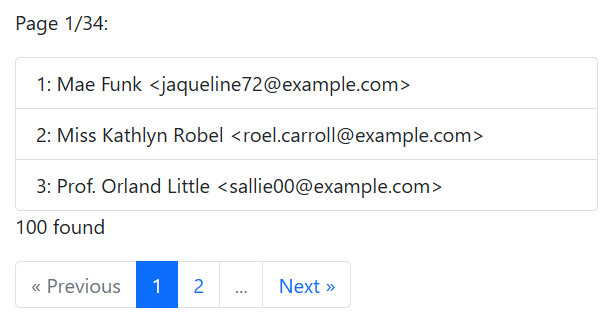

# Paginator with PDOStatement wrapper (without Laravel)

If you are prohibited from using frameworks like [Laravel](https://laravel.com/), this Paginator with [PDOStatement](https://www.php.net/manual/ja/class.pdostatement.php) wrapper might come to your rescue.

## Requirements

- PHP 8.2 or later
- PDO enabled

## Files

```
[project top]
　├─ app/Views/pagination.view.php --- Pagination View template
　├─ libs/
　│　　├─ DateTime.php --- DateTime wrapper
　│　　├─ DB.php --- DAO class
　│　　├─ DBStatement.php --- PDOStatement wrapper for pagination
　│　　├─ DynamicProperty.php --- Dynamic property emulator class
　│　　├─ helpers.php --- Helper functions
　│　　├─ HttpQueryString.php --- HTTP GET params accessor class
　│　　├─ LengthAwarePaginator.php --- Paginator class
　│　　├─ LinkItem.php --- Pagination link item class
　│　　├─ loader.php --- Class loader
　│　　├─ Log.php --- Logger class
　│　　├─ View.php --- Template engine class
　├─ logs/ --- directory for logs
　├─ public/index.php --- Main processor
```

## Usage

At first, import the `loader.php`. Then you can use classes under the `libs/` folder.

The `Libs\DB::raw()` method returns the instance of the `Libs\DBStatement` class, which is a `PDOStatement` wrapper.

You can set your own statement class derived from PDOStatement with `PDO::setAttribute()` method like this (written in `Libs\DB`):

```php
$this->dbh = new PDO($dsn, $dbuser, $dbpassword);
$this->dbh->setAttribute(PDO::ATTR_STATEMENT_CLASS, [DBStatement::class]);
```

The `Libs\DBStatement` class makes `paginate()` method available like this:

```php
<?php

require __DIR__ . "/../libs/loader.php";

use Libs\DB;

$users = (new DB)->raw("SELECT * FROM users")->paginate(5);
```

`$users` recieves the instance of `Libs\LengthAwarePaginator` class, which inherits from `ArrayObject`.

So, you can use `$users` in `foreach` loop like this:

```php
foreach ($users as $user) {
    echo $user["name"];
}
```

The `Libs\LengthAwarePaginator` allows you to output pagination links using `links()` method.

```php
$user->links();
```
Additionally, the `Libs\LengthAwarePaginator` supports the following methods:

- `onEachSide(int $onEachSide)`: sets the number of items on each side of the current page.
- `fragment(string $fragment)`: sets the fragment at the end of the pagination links.

## Usage Example

See more [public/index.php](public/index.php).

Run this code on your cli. (
It is assumed that 100 records have already been created in the database table `laravel.users`.)

```bash
php public/index.php
```

output:
```bash
<!doctype html>
<html>
    <head>
        <title>Pure PHP Paginator with PDOStatement Wrapper</title>
        <meta charset="utf-8">
    </head>
    <body>
        <link href="https://cdn.jsdelivr.net/npm/bootstrap@5.0.2/dist/css/bootstrap.min.css" rel="stylesheet" integrity="sha384-EVSTQN3/azprG1Anm3QDgpJLIm9Nao0Yz1ztcQTwFspd3yD65VohhpuuCOmLASjC" crossorigin="anonymous">
        <script src="https://cdn.jsdelivr.net/npm/bootstrap@5.0.2/dist/js/bootstrap.bundle.min.js" integrity="sha384-MrcW6ZMFYlzcLA8Nl+NtUVF0sA7MsXsP1UyJoMp4YLEuNSfAP+JcXn/tWtIaxVXM" crossorigin="anonymous"></script>
        <div class="card">
            <div class="card-body">
    <p>
Page 1/34:
    </p>
    <ul class="list-group">
            <li class="list-group-item">
              1: Mae Funk &lt;jaqueline72@example.com&gt;        </li>
            <li class="list-group-item">
              2: Miss Kathlyn Robel &lt;roel.carroll@example.com&gt;        </li>
            <li class="list-group-item">
              3: Prof. Orland Little &lt;sallie00@example.com&gt;        </li>
        </ul>
    <p>100 found</p>
<nav>
        <ul class="pagination">
                                        <li class="page-item disabled">
                <span class="page-link">&laquo; Previous</span>
            </li>
                                <li class="page-item active">
                        <a class="page-link" href="?page=1">
                1            </a>
                </li>
                                        <li class="page-item">
                <a class="page-link" href="?page=2">
                    2                </a>
            </li>
                                        <li class="page-item disabled">
                <span class="page-link">...</span>
            </li>
                                        <li class="page-item">
                <a class="page-link" href="?page=2">
                    Next &raquo;                </a>
            </li>
                        </ul>
</nav>
            </div>
        </div>
    </body>
</html>
```

This HTML will be displayed in a web browser as follows:



## LICENSE

[MIT](LICENSE)


Copyright (c) 2025 macocci7
